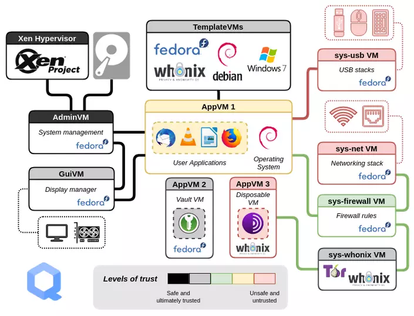

# Easy-qubes

> The Hitch Hikers Guide to Qubes OS, by Matt and Kieran.
> Qubes offers their own [Documentation](git@github.com:mattcoding4days/easy-qubes.git). Our guide
> begins at the initial setup [here](https://www.qubes-os.org/doc/installation-guide/#initial-setup)

## :warning: Things you should likely not do

1. If you are using **Pure Boot** please read these [instructions](https://docs.puri.sm/PureBoot/GettingStarted.html) before
   continueing 
   
2. **DO NOT** enable tor updates for Whonix, as who ever owns the majority of the nodes on TOR
   owns the network.    
   
3. One issue with Qubes is it only supports one desktop environment officially, which is Xfce.
   There is a KDE implementation but it is not officially supported and therefor we **DO NOT**
   reccomend using it.

## :keyboard: Generic linux commands to help you

> Do not type in the dollar sign, it represents the shell prompt.
> Directory is also called a `Folder`

```bash
# List absolute path to your present working directory
$ pwd

# move back one directory
$ cd ..

# cd into the home directory, the tilde `~` operator represents home in the unix world
$ cd ~

# if you are in your home directory cd into the Downloads directory
$ cd Downloads

# List the contents of your current directory
$ ls

# List the contents of your current directory and show the file permissions
$ ls -l

# List the contents and all hidden files (also known as dot files)
$ ls -a

# make a directory (new folder) called `Jorts`
$ mkdir Jorts

# Remove the folder called `Jorts`
$ rmdir Jorts

# Create a new file called `jorts.txt`
$ touch jorts.txt

# Remove the `jorts.txt`
$ rm jorts.txt
```

## :scroll: Whonix

> Informative blurb about whonix

<div align="Center">
  
</div>

## Desktop Environment

> The desktop environemtn on Qubes is called [Xfce](https://github.com/mattcoding4days/easy-qubes)

1. Opening the settings manager application
   * click on the **start menu** in the top left
   * click on **System Tools**
   * click on **Settings Manager**

2. Adjusting the global font size to make your screen more readable
   * click on **Appearance**
   * click on **Fonts**
   * Adjust the **DPI** value `Custom DPI settings: [92]`

## System management

### [Qubes Back up system](https://github.com/mattcoding4days/easy-qubes)

> Create the backups

```bash
# make the directories needed
$ mkdir -p ~/backup/etc/qubes && mkdir -p ~/backup/etc/qubes-rpc

# copy files from root space into the backup folders you just made
$ cp -a /etc/qubes/* ~/backup/etc/cubes/ && cp -a /etc/qubes-rpc/* ~/backup/etc/qubes-rpc/
```

> After the above commands are executed, follow the [remainder](https://www.qubes-os.org/doc/how-to-back-up-restore-and-migrate/#creating-a-backup) of the qubes back up guide for the rest

### [Updates](https://www.qubes-os.org/doc/how-to-back-up-restore-and-migrate/#creating-a-backup)

> Add the [Qubes security rss news feed](https://www.qubes-os.org/feed.xml) to your favourite RSS feed reader.

1. Use the Qubes built-in system updater to update Dom0, templates should be updated seperately

## Templates

1. Arch linux

## Vpn

## Obsidian

## Customized network programs

### Macchanger


